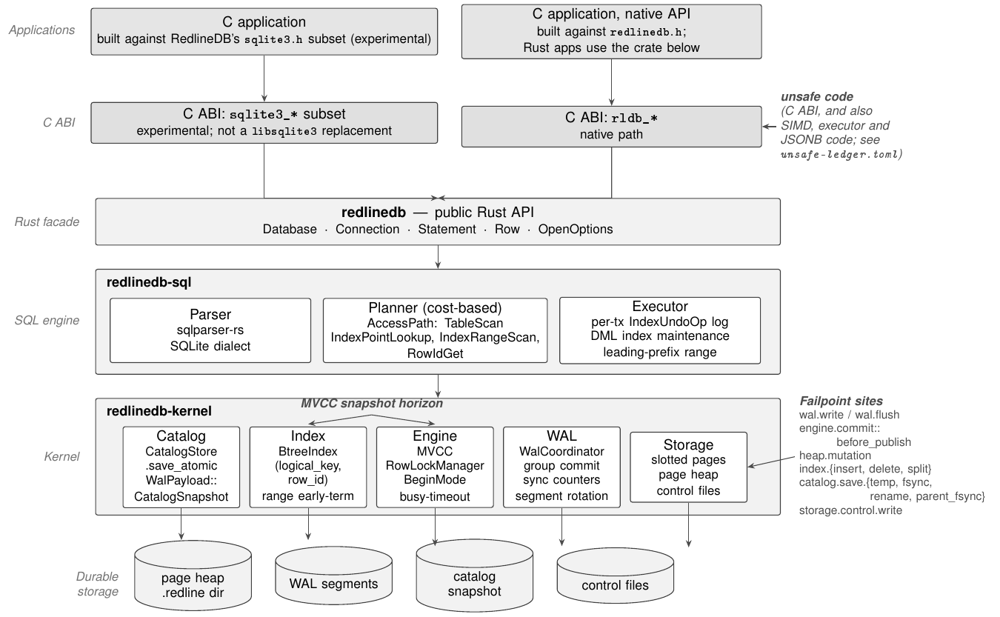

<p align="center">
  
</p>

<h1 align="center">RedlineDB</h1>

<p align="center">
  <em>An experimental embedded SQL engine in Rust: a SQLite-shaped shell and API over its own MVCC storage, with concurrent writers within one process, a group-commit WAL, and crash recovery.</em>
</p>

<p align="center">
  <!-- sqlite-parity-badge:begin -->
  <a href="#sqlite-parity-status"></a><!-- sqlite-parity-badge:end -->
  <a href="#postgresql-sql-shell-corpus"></a>
  <a href="docs/releases/v5.1.0.md"></a>
  <a href="LICENSE"></a>
  <a href="rust-toolchain.toml"></a>
</p>

RedlineDB is an embedded SQL engine written in Rust. Its shell and SQL dialect
are shaped like SQLite's, but the storage core is new: MVCC snapshots, a
concurrent B-tree, a group-commit write-ahead log, and crash recovery. Several
connections in one process can write at the same time. To share a database
between processes, run `redlinedb-server` in one of them.

> [!IMPORTANT]
> **v5.1.0 is an experimental release.** Read this before you depend on it.
>
> - **Not a replacement for SQLite.** The SQL and shell behavior are measured against the sqlite3 3.53.1 shell on a fixed corpus. Failing cases, if any, are listed with reasons in [`known-failures.json`](metadata/sqlite_parity/known-failures.json); the badge has the count.
> - **Its own file format.** A database is a directory (`data.redline`, `schema.redline`, `wal/`). RedlineDB cannot open SQLite database files, and SQLite cannot open RedlineDB databases. The first time v5.1.0 opens a database written by v4, it rebuilds every index; if a `UNIQUE` index would then hold two rows with one key, the open fails and changes nothing. Do not open the database with v4 afterwards: v4 refuses it when it has an index. Databases written before v4 have not been tested with v5.1.0. Back up before upgrading.
> - **The C ABI is an experimental subset.** `libredlinedb.so.5` exports RedlineDB's native `rldb_*` API and part of the `sqlite3_*` API. It is not a replacement `libsqlite3`.
> - **PostgreSQL support is a SQL-shell corpus only.** There is no PostgreSQL wire protocol, TLS, roles or SQLSTATE.
> - **Durability scope.** In the default `Strict` mode, a committed transaction survives a crash of the RedlineDB process on ext4 on a local NVMe SSD (Linux 6.8.0) ([receipt](benchmark-results/durability/v5.1.0-strict-process-kill.json)). Power loss and operating-system crashes are not claimed. See [docs/manual/durability.md](docs/manual/durability.md).
> - **Slower than SQLite today.** On the per-process CLI benchmark in the [version table](#versions-over-time), RedlineDB takes longer than SQLite on the median case.

## Compatibility qualification

The SQLite 3.53.1 and PostgreSQL 16.15 compatibility programs are incomplete.
CI runs both reference lanes and uploads their raw results and provenance. The
regression gate passes only when the failures are exactly the listed SQLite
known failures and the PostgreSQL baseline, in both directions. A passing gate
does not establish full SQL, ABI, database-file, or PostgreSQL wire
compatibility.

Some SQLite cases pass only through declared stand-ins, for example
`USING fts5`, `USING rtree` and `USING dbstat`, which are not SQLite's modules.
The [SQLite report](#sqlite-parity-status) lists every declared deviation and
shared rejection. In the PostgreSQL corpus, a case can agree because both
engines reject the statement with the declared error. Some unimplemented
features, such as `NOTIFY` delivery, are refused with `unsupported capability:`
and counted as declared unsupported. Others are stand-ins that agree only on
the transcript, such as publication DDL that replicates nothing. The
[capability matrix](docs/beyond-postgres-skips.md#capability-matrix) lists both.

Found a difference from SQLite? Open an issue with the script and both outputs.

## Quick start

### Install the binaries

Packages exist for Linux x86_64 and arm64 (glibc 2.35 or newer) and macOS 15 or
newer on Intel and Apple Silicon. They contain the `redlinedb` shell, the
`redlinedb-server` binary, the native library and C headers. Rust is not needed.

```bash quickstart
curl -fsSL https://raw.githubusercontent.com/neverhuman/redline/v5.1.0/install.sh | VERSION=v5.1.0 bash
export PATH="$HOME/.local/bin:$PATH"
```

```bash quickstart
redlinedb -batch :memory: 'SELECT 1;'
# prints: 1
```

Before it writes anything, the installer checks the archive's SHA-256 and that
the build-provenance record inside it names this repository and the release
tag. A checksum and a provenance file prove only that the download is intact:
set `REDLINEDB_VERIFY_ATTESTATION=1` (it needs the GitHub CLI) to also verify
the signed attestation that the release workflow of `neverhuman/redline` built
the archive, or run `gh attestation verify <archive> --repo neverhuman/redline`
yourself. The installer keeps each version under
`~/.local/lib/redlinedb/versions/` and switches versions with one rename, so a
failed upgrade leaves the previous version working; `REDLINEDB_ROLLBACK=1`
switches back. Set `PREFIX` to choose another root and `REDLINEDB_SHA256` to
require a specific archive digest. A prefix that an installer before v5.0.0
filled is refused until you set `REDLINEDB_MIGRATE_LEGACY=1`. The installer
installs no `sqlite3` binary or alias. It links RedlineDB's subset `sqlite3.h`
into `PREFIX/include`, except under `/usr` and `/usr/local`, where it would
shadow the system SQLite header; do not point other SQLite builds at that
directory. [docs/install.md](docs/install.md) is the full guide, and archives
and checksums are on
[GitHub Releases](https://github.com/neverhuman/redline/releases). CI runs the
`quickstart` blocks in this README against every platform's package
(`scripts/test-docs-quickstart.sh`).

`redlinedb-server` has no authentication or TLS. Bind it to localhost or a
trusted network.

### Use a database

The path is a directory that RedlineDB creates on first use.

```bash quickstart
db="$(mktemp -d)/demo.redline"
redlinedb -batch -bail "$db" "CREATE TABLE kv(k INTEGER PRIMARY KEY, v TEXT NOT NULL); INSERT INTO kv VALUES (1, 'hello');"
redlinedb -batch "$db" 'SELECT v FROM kv WHERE k = 1;'
# prints: hello
```

```bash quickstart
redlinedb stats "$db" --json
redlinedb backup "$db" "$db.bak" --physical
```

`redlinedb` with no SQL argument reads statements from standard input, as the
SQLite shell does. The maintenance subcommands are `backup`, `restore`,
`archive-check`, `replication-slot`, `stream-wal`, `stream-logical` and `stats`.
`redlinedb --build-info` prints the release tag and source commit a binary was
built from.

### Embed it in Rust

RedlineDB is not published on crates.io. Depend on the release tag and commit
your `Cargo.lock`; the Rust API may still change between releases
([docs/api-stability.md](docs/api-stability.md)).

```toml
[dependencies]
redlinedb = { git = "https://github.com/neverhuman/redline", tag = "v5.1.0" }
```

This is `crates/redlinedb/examples/readme.rs`; `cargo run -p redlinedb --example readme`
runs it in a checkout.

```rust readme
use redlinedb::Database;

fn main() -> redlinedb::Result<()> {
    let path = std::env::temp_dir().join("redlinedb-readme.redline");
    let db = Database::create(&path)?;
    let mut conn = db.connect()?;

    conn.execute(
        "CREATE TABLE IF NOT EXISTS kv(k INTEGER PRIMARY KEY, v TEXT NOT NULL)",
        (),
    )?;
    conn.execute("INSERT OR REPLACE INTO kv VALUES (1, 'hello')", ())?;

    let value: String = conn.query_row("SELECT v FROM kv WHERE k = 1", ())?;
    println!("{value}");
    Ok(())
}
```

### Build from source

Install Rust 1.95, a C/C++ compiler and pkg-config
(`scripts/ci-doctor.sh --profile core` checks them), then:

```bash
git clone https://github.com/neverhuman/redline
cd redline
git checkout v5.1.0
./scripts/build-from-source.sh
./scripts/install-from-source.sh
```

`install-from-source.sh` activates the build through the same installer, with
the same layout and rollback. Add `--all` to both scripts to include the
conformance runner, release tools and web console (the console also needs
Node 22 and npm).

### Read more

[docs/manual](docs/manual/README.md) is the book for operators and for people
embedding the engine. It was written against v4.1.0 and updated for v5.0.0
where the release changed what it describes; where it differs from the
generated blocks in this README, the blocks are the measurement.

## Engine throughput

This table measures work inside a single process on the calling thread. The
normal pair uses a memory-backed filesystem; the strict pair and its disk
syncs are included in the linked raw bundle.

<!-- engine-throughput:begin -->
<!-- engine-throughput:end -->

## Versions over time

This is the **startup-inclusive CLI latency** table: each case launches a new
RedlineDB or SQLite shell. It measures a different cost from the in-process
engine throughput table above.

Every row is a release build of the commit shown, re-run on today's corpus
against SQLite. The v5.0.0 row was measured at `55637d088`; nothing the
`redlinedb` shell is built from changed between that commit and the `v5.0.0`
tag. A lower ratio is better, and the note under the table says how it was
measured. Older versions are judged by today's stricter comparator, so their
pass counts are not comparable with the counts they published at the time.

<!-- version-history:begin -->
<!-- Generated by: `redline-testing version-history` from benchmark-results/sqlite-parity/releases/v5.0.0/summary.json; do not edit by hand. -->

| Version | Commit | SQLite corpus passed (of 2445, today's corpus) | Median latency ratio vs SQLite (lower is better) | p95 | Δ median vs previous |
| --- | --- | ---: | ---: | ---: | --- |
| v2.0.5 | `c02050824` | 1911 | 2.014× (2.013–2.020) | 2.282× (2.268–2.291) | — |
| v4.0.3 | `89a55f466` | 2305 | 2.183× (2.182–4.098) | 2.513× (2.513–9.045) | +8.4% |
| v4.0.8 | `fb9ef60ad` | 2305 | 2.200× (2.198–4.710) | 2.541× (2.522–6.107) | within noise |
| v4.0.9 | `02e297fd1` | 2305 | 2.217× (2.205–3.033) | 2.549× (2.536–12.091) | within noise |
| v4.1.0 | `af2082631` | 2364 | 2.112× (2.086–2.190) | 2.439× (2.416–5.288) | -4.7% |
| v5.0.0 | `55637d088` | 2368 | 2.246× (2.224–2.280) | 2.880× (2.563–5.617) | +6.3% |

Each ratio compares RedlineDB with SQLite on the same case, and lower is better. The time is per-case CLI process wall time (`cli_case_wall_time`): every sample starts a fresh `redlinedb` or SQLite shell, so process start-up is included. A case's ratio is RedlineDB's median over SQLite's median across 3 measured repetitions after 1 warmup. The table shows the median and nearest-rank p95 of those ratios over the 1899 cases every version passed in every run (the common pass set). Each version ran 3 time(s), interleaved with the others. The figure is the median run, and the parentheses give the min–max across runs. A change is shown only when the two versions' ranges do not overlap; otherwise it reads "within noise". "Passed" counts the corpus cases a version passed in every run.

Measured 2026-09-28 on AMD Ryzen Threadripper PRO 3995WX 64-Cores (128 CPUs, Linux 6.8.0-139-generic x86_64), pinned to CPUs 2-5, 1 worker(s), `--order alternate`, scratch directories on tmpfs, each version's built-in default durability. SQLite reference 3.53.1 (`fd3bdd25217a`); runner redline-testing 1.0.1. Every version was built with the release profile and RUSTFLAGS `""`, without PGO. Bundle: [`benchmark-results/sqlite-parity/releases/v5.0.0`](benchmark-results/sqlite-parity/releases/v5.0.0/).
<!-- version-history:end -->

Older published figures, most of which cannot be reproduced, are kept with
their caveats in [docs/performance-history.md](docs/performance-history.md).

## What's new in v5.1.0

Full notes: [docs/releases/v5.1.0.md](docs/releases/v5.1.0.md) and [CHANGELOG.md](CHANGELOG.md). The file format and the C ABI are those of v5.0.0.

- **SQLite's error text.** A statement SQLite rejects fails with SQLite's own message (`no such table: t`, `UNIQUE constraint failed: t.x`, `near "X": syntax error`, ...), in the shell and from `sqlite3_errmsg`; error codes keep their classes.
- **The shell reads scripts as sqlite3 does.** A failed line group is reported as `Parse error near line N: ...` and the script goes on unless `-bail`; SQL given as arguments still stops at its first failure.
- **Shell output.** BLOBs print their own bytes, `-escape ascii|symbol|off` applies to TEXT and BLOB, csv and tabs quote by sqlite3's rules, and `.schema`, `.dump`, `.fullschema`, `.parameter`, `.dbconfig`, `.show`, `.clone`, `.connection`, `.sha3sum`, `.shell` and `-memtrace` do what sqlite3's do. `.shell` and `.system` now run commands; `-safe` refuses them.
- **SQL.** `ALTER TABLE ... ADD COLUMN` accepts CHECK and keeps the column's text in the schema; `RAISE()` outside a trigger is refused; a `CASE ... END` inside a trigger body no longer ends the body.

## What's new in v5.0.0

Full notes: [docs/releases/v5.0.0.md](docs/releases/v5.0.0.md) and [CHANGELOG.md](CHANGELOG.md).

- **Crash recovery and WAL fixes.** A checkpoint writes every dirty page, so it no longer drops committed rows that another writer's page held. Recovery checks the WAL against the checkpoint before it changes any file and fails the open instead of silently losing commits, never hands out a transaction id the log already used, keeps a torn log tail in `wal/salvage/`, and reports what it did (`PRAGMA redline_recovery_report`). A commit whose log write fails after its record was queued reports an uncertain outcome instead of a rollback, and `COMMIT` returns only once a new transaction sees it. The database root, the `wal` directory and new segment names are fsynced before a commit that depends on them is acknowledged. An open takes `owner.lock` before it recovers anything.
- **A durability contract.** [docs/manual/durability.md](docs/manual/durability.md) states what each durability mode survives, and a release is published only with a receipt for its one claim: `Strict` survives a process kill. `PRAGMA redline_durability` reads back the mode in force.
- **SQL correctness fixes.** SQLite's comparison affinity, integer overflow (`SUM` overflow is an error; integer arithmetic overflow becomes REAL), exact INTEGER/REAL comparison, declared column collations (`NOCASE`, `RTRIM`) in comparisons, sorting, grouping, indexes and `UNIQUE`, set operations and `GROUP BY` on SQLite value equality, positional `ORDER BY`, partial indexes kept in step on `UPDATE`, CTE scoping and statements that re-read views and CTEs at execution, recursive CTEs under `LIMIT`, trigger chains, `SAVEPOINT`/`ROLLBACK TO`, and `REINDEX`, which used to do nothing.
- **Index-format epoch.** v5.0.0 rebuilds the indexes of a v4 database once, when it first opens it, and fails without changing anything if a `UNIQUE` index would then hold duplicates; v4 refuses the database afterwards when it has an index.
- **C ABI v5.** `sqlite3_prepare_v3` takes upstream's argument order, `SQLITE_NULL` is 5, column text and types follow each value's storage class, `:memory:` opens an ephemeral database, registrations and flags that RedlineDB cannot honour are refused instead of ignored, and the library is `libredlinedb.so.5` (`libredlinedb.5.dylib` on macOS).
- **Install and release.** The canonical repository is `neverhuman/redline`. Release archives carry checksums, build provenance bound to this repository and tag, and attestations; the installer keeps each version in its own directory and switches with one rename, so a failed install leaves the previous version working. `LICENSE` is the full Apache-2.0 text, with a `NOTICE`.
- **Stricter, published evidence.** Each SQLite case is held to its declared exit code, error text and byte-exact output against the pinned sqlite3 3.53.1 shell, and every failing case is published with its reason. PostgreSQL results are split by outcome, and the version table is rendered from a committed bench bundle. Pass counts are therefore not comparable with those published before v5.0.0.

## Evidence

The official lane (`just redline-testing-official`) builds the release shell
and the `subrepos/redline-testing` runner from this checkout, runs every case
against a reference, and records the source commit, binary digests and oracle
identity. The SQLite oracle is the sqlite3 3.53.1 shell built by
[`scripts/sqlite/build-reference.sh`](scripts/sqlite/build-reference.sh); the
PostgreSQL oracle is `psql` against a digest-pinned `postgres:16.15` image. The
lane runs RedlineDB with `REDLINEDB_DEFAULT_DURABILITY=normal` on a tmpfs
temporary root (`/dev/shm` where available), not the `Strict` default, because
it checks SQL behavior, not fsync. The blocks below are written by the runner
from that evidence, never by hand. That run executes many cases in parallel on
a shared host, so the SQLite block reports correctness only; latency is in the
version table above.

### SQLite SQL/CLI corpus

<a id="sqlite-parity-status"></a>
<!-- sqlite-parity-report:begin -->
**SQLite SQL/CLI corpus** (redline-testing `sqlite_parity`, SQLite 3.53.1 shell): **2440 / 2445** cases passed, **5** failed, **0** skipped. Updated 2026-09-29.

**Scope** (`sqlite_sql_cli`): each case runs one SQL or dot-command script through the `redlinedb` and SQLite shells and compares their output and exit status. It does not test C ABI semantics, the database file format, or prepared-statement state.

**Evidence:** qualified: official evidence run `c1b5daab170d` records the same 2445 total, 2440 passed, 5 failed, 0 skipped. Corpus `sqlite_parity` from redline-testing 1.0.1 (runner SHA-256 `224a0b0fa949`), corpus SHA-256 `542cf3afd9c5`; oracle SQLite 3.53.1 (binary SHA-256 `5efb87ca1598`), build stamp `36ca143645cf`. Run provenance `560a0c51dce6`: source tree `4eb671682ccd` (clean), source inputs `db02c7d2de12`, assertion policy `f9df5af05e65`.

**Declared deviations (6):** these cases pass, but RedlineDB produces the compared output without the SQLite feature behind it.

- `00093` CREATE_VIRTUAL_TABLE_FTS5_OPTIONAL: `USING fts5` creates an ordinary table, and `MATCH` is a case-insensitive substring or prefix test with no FTS5 query syntax or ranking.
- `00094` FTS5_HIGHLIGHT_OPTIONAL: `highlight()` wraps the literal term the last `MATCH` used; there is no FTS5 tokenizer.
- `00095` CREATE_VIRTUAL_TABLE_RTREE_OPTIONAL: `USING rtree` creates an ordinary table of the coordinate columns, with no R*Tree index.
- `00096` DBSTAT_OPTIONAL: `USING dbstat` creates a one-row table so `count(*) > 0` is 1; it reports no page statistics.
- `10405` PRAGMA_MODULE_LIST_FILTER: `pragma_module_list` prints SQLite's module names, including `fts3`, `fts4`, `fts3tokenize`, `fts4aux` and `fts5vocab`, which create no table.
- `12023` PRAGMA_COMPILE_OPTIONS: `PRAGMA compile_options` prints a fixed copy of the reference build's option list, not how RedlineDB was built.

**Declared shared rejections (6):** the pinned SQLite build lacks the feature, so these cases declare its error; a pass means RedlineDB rejected the statement too, not that the feature works.

- `00167` DOT_UNMODULE_CATALOG: The pinned sqlite3 is not an `SQLITE_DEBUG` build, and the 3.53.1 shell compiles `.unmodule` only under `SQLITE_DEBUG`, so `.unmodule fts5` is `unknown command or invalid arguments` and `.unmodule` itself is not tested.
- `00219` UPDATE_LIMIT_OPTIONAL: The 3.53.1 amalgamation parser is generated without SQLITE_UDL_CAPABLE_PARSER, so `UPDATE ... ORDER BY ... LIMIT` is `near "ORDER": syntax error` even though the reference build passes `-DSQLITE_ENABLE_UPDATE_DELETE_LIMIT`.
- `00220` DELETE_LIMIT_OPTIONAL: As 00219, for `DELETE ... ORDER BY ... LIMIT`.
- `11437` STRING_SOUNDEX_ROBERT: The pinned sqlite3 is built without `SQLITE_SOUNDEX`, so `soundex()` is `no such function` and `soundex()` itself is not tested.
- `11438` STRING_SOUNDEX_RUPERT: As 11437.
- `11439` STRING_SOUNDEX_X: As 11437.

**Declared oracle-build deviations (1):** these cases were written for a different SQLite build; against the pinned SQLite build they check what the reason states.

- `10546` MEDIAN_REQUIRES_CAPABILITY: Written to show that a default build has no `median()`. The pinned sqlite3 is built with `SQLITE_ENABLE_PERCENTILE`, so the case checks that `median()` of 1..5 is 3.0; the missing-function error is not tested.

**Performance:** this lane runs every case at once on a shared host to check correctness, so its timings are not a benchmark. Latency is measured separately on a quiet host; see [Versions over time](#versions-over-time).

**Run metadata:** RedlineDB target version **redlinedb v5.1.0 (tested against SQLite 3.53.1)**, SQLite reference version **3.53.1 2026-05-05 10:34:17 c88b22011a54b4f6fbd149e9f8e4de77658ce58143a1af0e3785e4e6475127e9 (64-bit)**, redline-testing runner version **redline-testing 1.0.1**.

<!-- sqlite-parity-report:end -->

Every failing case, with the reason it fails and the phase that owns the fix,
is in [`metadata/sqlite_parity/known-failures.json`](metadata/sqlite_parity/known-failures.json).

### PostgreSQL 16.15 SQL-shell corpus

<a id="postgresql-sql-shell-corpus"></a>
<!-- POSTGRES_PARITY_START -->
PostgreSQL **16.15** SQL-shell corpus (`redlinedb` CLI, `REDLINEDB_RESULT_DIALECT=postgres`, fresh `:memory:` per case): **254/265 agree** = **242** row matches + **12** expected rejections (declared error text verified); **11** declared unsupported; **0** mismatches; **0** skipped.

Agreement is normalized SQL-shell transcript agreement, not typed-result or application parity. Not covered: wire protocol, TLS, roles/authorization, SQLSTATE, NOTIFY delivery, replication/CDC, extensions ([capability matrix](docs/beyond-postgres-skips.md#capability-matrix)). Source `083e5efa3bbafa1e5dd2b2959cbe36d6acff9471`; corpus SHA-256 `b240a7204eeb46893ea1f06e715a144f6cd962efe8f41041582e52ca975cd5be`.
<!-- POSTGRES_PARITY_END -->

More detail: [docs/sqlite-parity.md](docs/sqlite-parity.md) (reference build
and deviations), [docs/beyond-postgres-skips.md](docs/beyond-postgres-skips.md)
(PostgreSQL capability matrix) and [`metadata/`](metadata/) (known failures and
the PostgreSQL regression baseline).

## Architecture

<p align="center">
  
</p>

<p align="center">
  
</p>

RedlineDB is a layered Rust workspace. Lower layers never depend on higher ones.

- `crates/redlinedb` is the public embedded API (`Database`, `Connection`, RQL entry points).
- `crates/redlinedb-tokio` is a Tokio adapter; `crates/redlinedb-sqlx` bridges SQLx's `Any` driver to RedlineDB URLs.
- `crates/sql` owns the parser, planner, executor, the SQLite and PostgreSQL dialect shims, and RQL lowering.
- `crates/kernel` owns storage: pages, B-trees, MVCC, the WAL, checkpoints, the catalog, and recovery.
- `crates/domain` holds shared, policy-free types such as the typed domain error.
- `crates/ffi` builds `libredlinedb`, which exports the native `rldb_*` C ABI ([`redlinedb.h`](contracts/c-abi/redlinedb.h)) and an experimental `sqlite3_*`-shaped subset ([`sqlite3.h`](contracts/c-abi/sqlite3.h)).
- `crates/cli` is the `redlinedb` shell and its maintenance subcommands.
- `crates/redlinedb-lite` is a std-only front binary that answers a small shell surface and hands everything else to `redlinedb`.
- `crates/server` is `redlinedb-server`, a small framed TCP protocol (not the PostgreSQL wire protocol) with no authentication or TLS.
- `crates/bench` holds engine-local tests and perf tooling; it does not produce official evidence.

| Path | Purpose |
|---|---|
| `subrepos/redline-testing` | Official conformance runner, corpora and report renderers |
| `subrepos/redline-web`, `redline-central`, `redline-split-ops` | Web console, Rust client and database shim, release tooling |
| `metadata/` | SQLite known failures, PostgreSQL regression baseline and capability matrix |
| `contracts/` | C ABI headers (`contracts/c-abi`) |
| `ops/` | CI scripts and git hooks |
| `benchmark-results/` | Committed evidence, reports and release bench bundles |
| `docs/` | Manual, architecture, testing and release runbooks |
| `paper/` | Historical preprint; see [paper/README.md](paper/README.md) |

## RQL

RQL is an additive, default-off typed relational IR: callers submit JSON or Rust
values that lower straight into executor plans without the SQL parser. In the
v5.1.0 official evidence (`083e5efa3`, 2026-09-29), the `rql_phase1`
suite passed 1183 of 1385 cases. It skipped 202, each
declared in advance: 105 the phase-1 rewriter cannot parse or lower,
77 known differences between RQL and SQLite output, and
20 expected-error cases the suite does not run through RQL.
See [docs/rql.md](docs/rql.md).

## Development and contributing

`just required` is the protected PR lane. It runs every CI family (engine,
testing, central, web, release tools, integration, parity and packaging), then
the jankurai security check and the audit family. `just fast` is the default
local proof lane.

```bash
just fast
just required
```

Read [CONTRIBUTING.md](CONTRIBUTING.md) and [AGENTS.md](AGENTS.md), then
[docs/testing.md](docs/testing.md) for proof lanes and
[docs/architecture.md](docs/architecture.md) for component boundaries. Keep
changes narrow. Change generated README blocks only through their renderers:
`just sqlite-parity-report-update` for the SQLite badge and report,
`redline-testing check-postgres … --readme README.md` for the PostgreSQL block
(`ops/ci/sqlite-parity-report.sh update` runs both), and
`redline-scoreboard render --bundle benchmark-results/perf/releases/… --target README.md`
for the engine throughput block after `summarize --check` reports a publishable
bundle, and
`redline-testing version-history --bundle … --readme README.md` for the version
table. Official SQLite, memory, RQL and PostgreSQL evidence is produced only by
`subrepos/redline-testing`; engine-local tests are regression checks.
[docs/release.md](docs/release.md) is the release and rollback runbook, and
[SECURITY.md](SECURITY.md) says how to report a vulnerability.

## Citing

Cite the software release using [CITATION.cff](CITATION.cff) (GitHub shows it
under "Cite this repository"). The preprint in `paper/` is historical: its
numbers do not reconcile with its own methodology and are not evidence for this
release ([paper/README.md](paper/README.md)).

## License

Apache-2.0. See [LICENSE](LICENSE) and [NOTICE](NOTICE).
