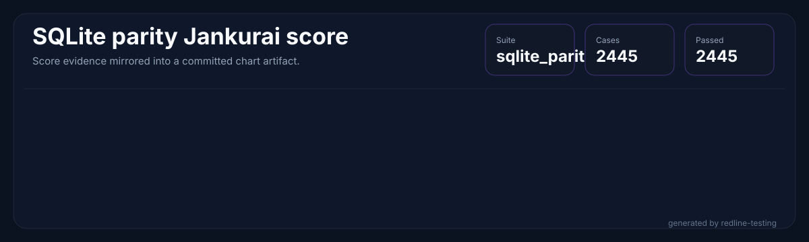
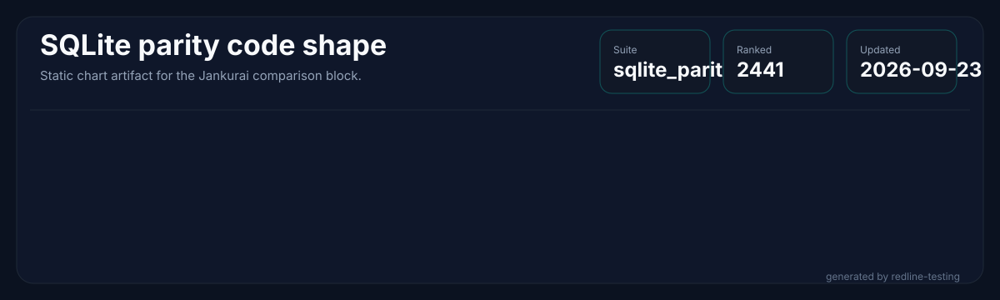
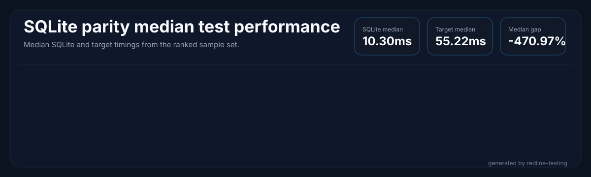
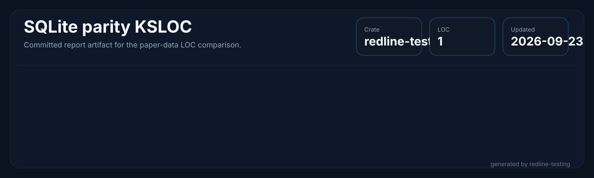
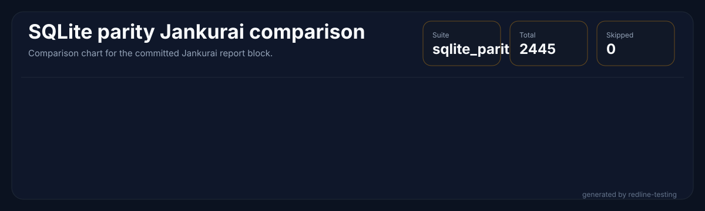
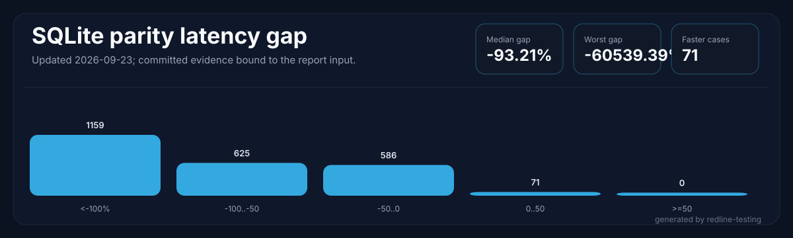
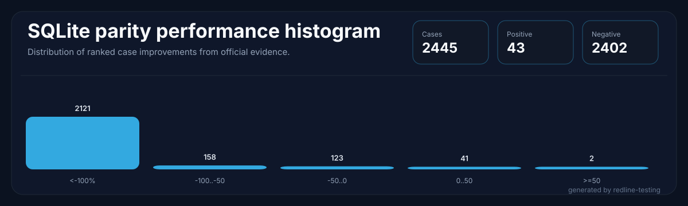

<p align="center">
  
</p>

<h1 align="center">RedlineDB</h1>

<p align="center">
  <em>Rust-native embedded SQL with SQLite-shaped compatibility, concurrent writes, and deterministic recovery.</em>
</p>

<p align="center">
  <a href="#whats-new-in-v400"></a>
  <a href="#whats-new-in-v400"></a>
  <a href="LICENSE"></a>
  <a href="rust-toolchain.toml"></a>
  
  <!-- jankurai-score-badge:begin -->
  <a href=".jankurai/repo-score.md"></a>
  <!-- jankurai-score-badge:end -->
</p>

RedlineDB is an embedded SQL engine written in Rust. It keeps the SQLite-facing
API familiar while replacing the storage core with MVCC, a concurrent B-tree,
group-commit WAL, and crash recovery designed for multi-writer workloads.

## Compatibility qualification

The SQLite 3.53.1 and PostgreSQL 16.15 compatibility programs are incomplete.
CI executes both reference lanes and uploads their raw results and provenance.
A passing regression gate means recorded failures have not increased; it does
not establish full SQL, ABI, database-file, or PostgreSQL wire compatibility.

The book for operators and for people embedding the engine is
[docs/manual](docs/manual/README.md). It is written against a named commit
and it says which file to trust when a badge and a report disagree.

<!-- POSTGRES_PARITY_START -->
PostgreSQL **16.15** SQL-shell corpus: **265 / 265 passed**, **0 failed**, **0 skipped**. Corpus qualification: **passed**. Regression gate: **passed**.

All corpus cases run in CI; known failures remain failures. PostgreSQL wire/client and full application compatibility remain unverified. Source: `unrecorded` (dirty workspace); corpus SHA-256: `b240a7204eeb46893ea1f06e715a144f6cd962efe8f41041582e52ca975cd5be`.
<!-- POSTGRES_PARITY_END -->

## What's new in v4.0.9 → v4.1.0 (W7 startup optimization)

**W7** eliminates unnecessary syscalls from the in-memory database startup path.
Every process invocation of `redlinedb` previously walked the Linux cgroup
hierarchy to detect CPU parallelism — even for volatile (in-memory) databases
that don't need it. v4.1.0 fixes both call sites.

| Change | Detail |
|---|---|
| `EngineConfig::default()` | No longer calls `cached_available_parallelism()`. Volatile DBs use fixed shard defaults; persistent DBs call `with_detected_parallelism()` inside `Engine::create_inner`. |
| `BufferPool::new_with_parallelism()` | New cgroup-walk-free constructor; volatile path uses it directly with a derived hint. |
| `Engine::create_inner` split | Volatile databases skip `create_dir_all` (caller already did it), skip the cgroup walk, and get a lean shard layout. |

**Startup overhead removed per process:** ~6 syscalls (`openat /proc/self/cgroup` + walk of `/sys/fs/cgroup/.../cpu.max`).

### Version performance history

Per-process latency ratio vs SQLite 3.53.1 — 294-case medium parity benchmark,
882 samples (294 cases × 3 reps), memory profile. Binary: release + fat LTO;
v4.0.9 and v4.1.0 additionally PGO-optimized (quick training set, `clang-18`).

| Version | Median ratio | p95 ratio | Δ median | Δ p95 | Key change |
|---------|:-----------:|:--------:|:-------:|:-----:|------------|
| v4.0.8 | 1.846× | 2.429× | — | — | Release baseline |
| v4.0.9 | 1.780× | 1.990× | −3.6% | −18.1% | PGO quick-training added |
| **v4.1.0** | **1.749×** | **1.887×** | **−1.7%** | **−5.2%** | W7: cgroup-walk bypass |

_Cumulative v4.0.8 → v4.1.0: median **−5.3%**, p95 **−22.3%**._

> These are retained historical subset measurements from before the
> external-only evidence cutover. Current release evidence uses the complete
> corpus through the verified `redline-testing` workflow.

## What's new in v4.0.1 → v4.0.8 (Phase 5 / Phase 6 release train)

**Phase 5** (v4.0.1) shipped 20+ workstreams across five waves — median ratio vs SQLite **1.904× → 1.857×**, cases ≥ 2.0× slower **193 → 60 (−69%)**. **Phase 6** (v4.0.2 → v4.0.8) ships eight further releases — full per-version detail in [CHANGELOG.md](CHANGELOG.md). Highlights:

| Release | Work-stream | Headline |
|---|---|---|
| v4.0.4 | R2 — ScalarProgram VM dispatch + parallel-scan kernel API + AccessPath IR planner wiring | +55 tests; PRAGMA toggles for opt-in |
| v4.0.5 | R3-B — per-PreparedStatement VM compile cache | +11 tests; thread-local scoped cache |
| v4.0.6 | R3-C + R4-A — SQL-side parallel-scan dispatch + Morsel hash-aggregator | +21 tests; AVX2 SUM(i64) **14.4× speedup** vs scalar |
| v4.0.7 | R4-B — WAL group-commit pipeline (`wal_pipeline` feature) | **194× WAL throughput speedup**, 250× syscall reduction |
| v4.0.8 | R3-A — `PRAGMA redline_scalar_vm` + `PRAGMA redline_planner_use_access_path` | SQL surface for the R2-A/R2-C toggles |

Workspace test count: **1786 → 1990 (+204)** with zero regressions. SIMD wins gated behind runtime `is_x86_feature_detected!` dispatch + the `unsafe-ledger.toml` audit; WAL group-commit and parallel-scan dispatch are feature-flagged so default builds remain byte-identical to v4.0.3.

Updated SQLite-parity-corpus numbers will appear in the auto-generated `## Engine Metrics` block below on the next CI benchmark refresh; the v4.0.0 ratio table in the section that follows is the last hand-measured snapshot, retained for historical context.

## What's new in v4.0.0

**Phase 0-4 SQLite-parity speed-gap closure.** Fourteen named optimizations across the build profile, parser, scalar fast paths, and CTE/aggregate/window hot paths, measured against the external [`redline-testing v1.0.0`](https://github.com/neverhuman/redline-testing) parity harness on the full 2445-case `sqlite_parity` suite. Median per-case latency ratio against SQLite improved from **1.837× → 1.738×** with **zero parity regressions** (identical 2374/2445 pass set in v3.0.0 and v4.0.0; the 67 failures are pre-existing edge cases in `typeof()` reporting, IEEE-754 last-digit precision, fullwidth Unicode case-folding, BLOB hex encoding, and `AUTOINCREMENT` semantics). Jankurai code-health score holds at **85/100 (pass)**.

> **Note on corpus size.** The redline-testing official corpus has grown from 1127 cases (prior CI snapshot) to **2445 cases** in v1.0.0. The v4.0.0 numbers in this section are measured against the larger current corpus. The auto-generated `## Engine Metrics` block below still reflects the previous 1127-case CI snapshot and will be refreshed by the next CI parity report.

### Per-case latency distribution — RedlineDB / SQLite ratio (full 2445-case corpus, passed cases only)

| Bucket | v3.0.0 (main) | v4.0.0 | Delta |
|---|---:|---:|---:|
| `< 1.0×` (RedlineDB faster than SQLite) | 7 | 8 | **+1** |
| `1.0 – 1.2×` | 16 | 28 | **+12** |
| `1.2 – 1.5×` | 173 | 292 | **+119** |
| `1.5 – 2.0×` | 1622 | 1748 | **+126** |
| `2.0 – 3.0×` | 555 | 297 | **−258** |
| `≥ 3.0×` (tail outliers) | 1 | 1 | 0 |
| **Total** | **2374** | **2374** | 0 |

258 cases moved out of the `2.0–3.0×` slow band; 119 moved into the `1.2–1.5×` band. Per-case: **1410 cases (59.4%) are ≥5% faster** in v4.0.0, 386 (16.3%) are ≥5% slower, 578 (24.3%) within ±5% noise. Mean per-case target-latency change: **−6.85%** (median **−7.67%**).

### Named optimizations shipped

| Phase | Commit | Optimization |
|---|---|---|
| 1.1 | `f8ed61f` | fat LTO + `opt-level=3` + `target-cpu=native` release profile |
| 1.2 | `b62d4ad` | parser rewrite-pass allocation elimination |
| 1.3 | `4a89e9a` | borrow + stack-buffer function-name lowercase |
| 1.4 | `b229f90` | cache + lighten `/dev/shm` writability probe |
| 1.5 | `2e13dc5` | fromless `SELECT` fast path |
| 1.6 | `a20de92` | `ahash::RandomState` for `StatementCache` |
| 2.1–2.2 | `5bbe650` | ASCII fast paths for `LENGTH`/`UPPER`/`LOWER` + `memmem` for `INSTR` |
| 2.3+2.5 | `9abab6c` | `value_as_str` + hot scalar fn migration to `Cow` |
| 2.4 | `32e078d` | `itoa` for streaming i64 CLI output |
| 4.1 | `efc9a6e` | fromless-SELECT walker covers `sqlparser` scalar variants |
| 4.2 | `d348e0b` | dedup aggregate cache key + reuse fn-name lower |
| 4.3 | `e569d6c` | capacity hints in per-row hot allocations |
| 4.4 | `32200c2` | hoist CTE lowercase out of recursive iteration loop |
| 4.5 | `2f21ea3` | reuse scratch buffer for window partition keys |

### Benchmark provenance

- **Harness:** [`redline-testing v1.0.0`](https://github.com/neverhuman/redline-testing) — external repository, not in-tree fixtures.
- **SQLite reference:** `sqlite3 3.53.1` (release build, SHA-256 `fd3bdd25217a849f8f4fa295fb78199cfd69b0c4d47ba8d8c32a1aa328bd147e`).
- **Workload:** full `sqlite_parity` suite — 2445 cases × 3 measured reps + 1 warmup, **`--workers 30`** on a 128-core Linux x86_64 host, no CPU pinning.
- **Target binary (v4.0.0):** SHA-256 `7ae60cb513e866b4a94996968b0c6b9f01b0071776bc842f526702be33f05e56` (release profile, fat LTO, `target-cpu=native`).
- **Baseline binary (v3.0.0):** SHA-256 `da770dfd25beeb36aa22f8ce7a09d935b4e9fd7c8b2a77c36e621c46cec69ef2`.
- **Raw JSONL evidence (committed):** [`benchmark-results/sqlite-parity/perf-baselines/v3.0.0-baseline.jsonl`](benchmark-results/sqlite-parity/perf-baselines/v3.0.0-baseline.jsonl), [`v4.0.0-baseline.jsonl`](benchmark-results/sqlite-parity/perf-baselines/v4.0.0-baseline.jsonl), and the structured A/B summary [`v3-vs-v4-summary.json`](benchmark-results/sqlite-parity/perf-baselines/v3-vs-v4-summary.json).
- **Reproduce:**
  ```bash
  cargo build --release -p redlinedb-cli
  PERF_WORKERS=30 \
    REDLINE_TESTING_BIN=/path/to/redline-testing \
    SQLITE_REF_BIN=/path/to/sqlite3-3.53.1 \
    scripts/perf/full.sh target/release/redlinedb v4.0.0-final
  ```

### RQL phase-1 local benchmark

RQL is an additive, default-off typed IR path: SQL remains the compatibility
frontend, and the existing SQLite/Postgres benchmark suites still run SQL. The
`rql_phase1` suite in `redline-testing` rewrites the phase-1 SQL cases to RQL
for the RedlineDB target while keeping SQLite on the original SQL reference.

Measured locally on 2026-05-26 with `redline-testing v1.0.0`,
`redlinedb v4.0.1`, `sqlite3 3.45.1`, release binaries, 1 warmup + 3 measured
repetitions, `--workers 1`:

| Comparison | Scope | Result |
|---|---:|---:|
| RQL phase-1 parity | 1,385 candidates | 1,129 passed, 256 skipped, 0 failed |
| RedlineDB SQL median target latency | 1,129 shared passed cases | 3.596 ms |
| RedlineDB RQL median target latency | 1,129 shared passed cases | 3.419 ms |
| RQL / RedlineDB SQL median target ratio | 1,129 shared passed cases | **0.937×** |
| RQL / RedlineDB SQL aggregate target ratio | 3,387 measured samples | **0.894×** |
| Case movement vs RedlineDB SQL | 1,129 shared passed cases | 620 ≥5% faster, 298 within ±5%, 211 ≥5% slower |
| P0 RQL / RedlineDB SQL median target ratio | 577 shared P0 cases | **0.925×** |
| RQL / SQLite SQL median ratio | 1,129 RQL-passed cases | 1.822× |

Read this as an early viability signal, not an upper bound. RQL already saves
about **6.3% median target latency** versus RedlineDB's SQL frontend on the same
phase-1 passed cases, even though v0.1 still lowers most relational work into
the existing executor and inherits the same CLI process-per-case benchmark
overhead. The next RQL performance work should focus on widening the direct
lowering path and removing compatibility-only planner work that RQL no longer
needs.

Reproduce the local comparison:

```bash
cargo build --release -p redlinedb-cli
redline-testing run --suite rql_phase1 \
  --target-bin target/release/redlinedb \
  --sqlite-bin sqlite3 \
  --output target/rql-phase1-bench/rql_phase1.raw.jsonl \
  --tmp-root /tmp/rql-phase1-bench \
  --workers 1 --repetitions 3 --warmup 1 --progress never

# Same target binary, SQL compatibility path, filtered afterward to the
# rql_phase1 case IDs that passed both runs. This full-suite SQL command may
# exit non-zero if unrelated sqlite_parity cases fail in the local environment.
redline-testing run --suite sqlite_parity \
  --target-bin target/release/redlinedb \
  --sqlite-bin sqlite3 \
  --output target/rql-phase1-bench/sqlite_parity.raw.jsonl \
  --tmp-root /tmp/rql-phase1-sql-bench \
  --workers 1 --repetitions 3 --warmup 1 --progress never
```

### Jankurai code-health score (v4.0.0)

**85 / 100 — `pass` (advisory)** — unchanged from main; Phase 0-4 perf work introduced no code-health regressions. Full report at [`.jankurai/repo-score.md`](.jankurai/repo-score.md). Top dimensions: Ownership & navigation (100), Proof lanes & test routing (98), Contract & boundary integrity (88), Security & supply-chain posture (86).

## Engine Metrics

<!-- sqlite-parity-metrics:begin -->










<!-- sqlite-parity-metrics:end -->

## Redline Mission

RedlineDB keeps SQLite-shaped compatibility where that contract is valuable:
small embedded deployments, familiar SQL, a direct Rust API, and a SQLite-shaped
C surface for integrations that already expect it.

The engine is not a SQLite wrapper. It rebuilds the storage core in Rust so
MVCC, concurrent writes, WAL behavior, and recovery can be owned directly
instead of treated as constraints inherited from a single-writer file engine.

The codebase is also shaped for fast repair by agents and humans: smaller
modules, local invariants, routed proof lanes, generated evidence, and audit
metadata that point a fix at the narrowest lawful surface.

## At a Glance

| Area | What it is |
|---|---|
| Rust API | `redlinedb` for embedded use |
| CLI | `redlinedb-cli` for shell-style workflows |
| FFI | `crates/ffi` exports a SQLite-shaped C ABI surface |
| SQL engine | Parser, planner, executor, pragmas, and compatibility shims |
| Storage | Kernel-owned MVCC, WAL, catalog, and recovery layers |
| Default proof lane | `just fast` |
| Protected required lane | `just required` |
| SQLite parity gate | `just redline-testing-official` |

## Install

### Rust library

Use the engine library from the same source release:

```toml
[dependencies]
redlinedb = { git = "https://github.com/neverhuman/RedlineDB", tag = "v4.1.0" }
```

Commit `Cargo.lock` for reproducible application builds. Existing crates.io
versions remain available; GitHub package publication does not publish new
crates.io versions.

### Install binaries

Linux x86_64/ARM64 and macOS Intel/Apple Silicon packages include the CLI,
server, native libraries and C headers. Rust and Node are not needed to run them.
Linux packages require glibc 2.35 or newer; macOS packages require macOS 15 or newer.

```bash
curl -fsSL https://raw.githubusercontent.com/neverhuman/RedlineDB/main/install.sh | bash
```

The installer verifies the release checksum and defaults to `~/.local`. To select
a release and an installation directory:

```bash
curl -fsSL https://raw.githubusercontent.com/neverhuman/RedlineDB/main/install.sh | \
  VERSION=v4.1.0 PREFIX="$HOME/redline install" bash
```

It installs `redlinedb` and `redlinedb-server`; it never replaces `sqlite3`.
Set `REDLINEDB_SHA256` to additionally require a particular archive digest.

### Build from source

Install Rust 1.95, a C/C++ compiler and pkg-config, then run:

```bash
git clone https://github.com/neverhuman/redlineDB
cd redlineDB
./scripts/build-from-source.sh
./scripts/install-from-source.sh
```

The source archive from GitHub works with the same scripts. An ordinary clone
contains the engine and all supporting components; no private forge or sibling
checkout is needed. Add `--all` to both scripts to include the testing runner,
release tools and web console (building the console also requires Node 22/npm).
Use `PREFIX` for the installation root and `CARGO_BUILD_JOBS` to limit build jobs.

### Components and downloads

| Component | Source | Release package |
|---|---|---|
| Engine, CLI, server, adapters, FFI | `crates/` | `redlinedb-v4.1.0-<platform>.tar.gz` |
| Conformance runner | `subrepos/redline-testing` | `redline-testing-v4.1.0-<platform>.tar.gz` |
| Embedded web console | `subrepos/redline-web` | `redline-web-v4.1.0-<platform>.tar.gz` |
| Rust client and database shim | `subrepos/redline-central` | source |
| Release tooling | `subrepos/redline-split-ops` | source |
| Historical public hub | `subrepos/redline` | source |

Download packages and checksums from [GitHub Releases](https://github.com/neverhuman/RedlineDB/releases).
Platform names are `linux-x86_64`, `linux-arm64`, `macos-x86_64`, and `macos-arm64`.
Optional packages extract alongside the core package. Start the console with
`redline-web --target-bin /path/to/redlinedb`.

Each package includes dependency notices, an SBOM and parent-commit build metadata.
GitHub Releases also attach build provenance attestations. [subrepos.toml](subrepos.toml)
records the initial component identities; [migration records](docs/migration/README.md)
explain preserved histories and the unfinished work kept outside the release.

### Embedded use

```rust
use redlinedb::Database;

fn main() -> redlinedb::Result<()> {
    let db = Database::create("/tmp/demo.redline")?;
    let mut conn = db.connect()?;

    conn.execute("CREATE TABLE kv(k INTEGER PRIMARY KEY, v TEXT NOT NULL)", ())?;
    conn.execute("INSERT INTO kv VALUES (1, 'hello')", ())?;

    let value: String = conn.query_row("SELECT v FROM kv WHERE k = 1", ())?;
    println!("{value}");

    Ok(())
}
```

### CLI use

```bash
rtk cargo run -p redlinedb-cli --release -- exec /tmp/demo.redline "SELECT count(*) FROM kv"
rtk cargo run -p redlinedb-cli --release -- stats /tmp/demo.redline --json
rtk cargo run -p redlinedb-cli --release -- backup /tmp/demo.redline /tmp/demo.bak --physical
```

### Default verification

```bash
rtk just fast
rtk just redline-testing-official
rtk just sqlite-parity-report-check
```

## SQLite Parity Status

The official parity lane builds `subrepos/redline-testing` and the engine from
this same checkout. Its processed evidence binds raw results to the runner's
SHA-256 and enforces the declared suites and compatibility baselines. The report
below is a dated historical measurement from
`benchmark-results/sqlite-parity/latest/`; its original provenance is preserved.
Current acceptance evidence is attached to the GitHub CI run.

<!-- sqlite-parity-report:begin -->
**SQLite parity coverage:** **2441 / 2445** cases passed in CI. Failed: **0**. Skipped: **4**. Updated 2026-09-23.

**SQLite parity latency:** median gap **-93.21%**, worst gap **-60539.39%**, faster cases **71**.

**Benchmark metadata:** RedlineDB target version **redlinedb v4.1.0 (SQLite 3.45.1 compatibility)**, SQLite reference version **3.53.1 2026-05-05 10:34:17 c88b22011a54b4f6fbd149e9f8e4de77658ce58143a1af0e3785e4e6475127e9 (64-bit)**, redline-testing runner version **redline-testing 1.0.1**.





<details id="sqlite-parity-ranked-table">
<summary>Full ranked latency table</summary>

| Rank | Case | Priority | Profile | Category | SQLite median ns | RedlineDB median ns | Improvement |
| ---: | --- | --- | --- | --- | ---: | ---: | ---: |
| 1 | SCALAR_STRING_014 | P1 | memory | GEN_SQL_SCALAR | 3271541 | 1983842407 | -60539.39% |
| 2 | SCALAR_NULL_COALESCE_003 | P1 | memory | GEN_SQL_SCALAR | 4048812 | 2076704698 | -51191.70% |
| 3 | SELECT_WHERE_ORDER_LIMIT_OFFSET | P0 | memory | SQL_SELECT | 3121136 | 1438786471 | -45998.17% |
| 4 | BETWEEN_IN_ISNULL_IS | P0 | memory | SQL_OPERATORS | 2963498 | 1295900371 | -43096.68% |
| 5 | CASE_COALESCE_NULLIF_IIF | P0 | memory | SQL_EXPRESSIONS | 2446459 | 1287487199 | -42816.24% |
| 6 | OPT_PCACHETRACE_CATALOG | P4 | catalog | CLI_OPTION_CATALOG | 2719837 | 1271967891 | -42298.93% |
| 7 | DOT_SHA3SUM | P0 | memory | CLI_DOT_COMMAND | 3984610 | 1655618704 | -41450.33% |
| 8 | SCALAR_ARITH_029 | P1 | memory | GEN_SQL_SCALAR | 2884509 | 1217638170 | -40487.94% |
| 9 | OPT_IFEXISTS_NEGATIVE_TEMPFILE | P3 | tempfile | CLI_OPTION_TEMPFILE_DIAGNOSTIC | 2745295 | 1205216244 | -40073.87% |
| 10 | DOT_ECHO | P0 | memory | CLI_DOT_COMMAND | 3308120 | 1271142790 | -38324.93% |
| 11 | CORE_STRING_FUNCTIONS | P0 | memory | SQL_FUNCTIONS | 2189143 | 1130105267 | -37570.18% |
| 12 | DOT_LOG | P0 | memory | CLI_DOT_COMMAND | 2431982 | 1114328382 | -37044.28% |
| 13 | OPT_BOX_MODE | P2 | memory | CLI_OPTION | 6190705 | 2170527813 | -34961.08% |
| 14 | BEGIN_MODES | P0 | memory | SQL_TRANSACTION | 2232895 | 1010166811 | -33572.23% |
| 15 | CAST_AND_TYPE_AFFINITY | P0 | memory | SQL_EXPRESSIONS | 2778338 | 974403986 | -32380.13% |
| 16 | BLOBS_HEX_ZEROBLOB | P0 | memory | SQL_FUNCTIONS | 3935999 | 1241722316 | -31447.83% |
| 17 | CHECK_CONSTRAINT_FAILURE | P0 | memory | SQL_CONSTRAINTS_NEGATIVE | 2774180 | 927759438 | -30825.31% |
| 18 | FOREIGN_KEY_FAILURE | P0 | memory | SQL_FOREIGN_KEYS_NEGATIVE | 2219389 | 889704175 | -29556.81% |
| 19 | SCALAR_CAST_TYPEOF_033 | P1 | memory | GEN_SQL_SCALAR | 2767828 | 861415521 | -28613.85% |
| 20 | CREATE_VIEW | P0 | memory | SQL_VIEW | 2228728 | 836626603 | -27787.55% |
| 21 | LIKE_GLOB_MATCH_ESCAPE | P0 | memory | SQL_OPERATORS | 2804838 | 790784412 | -26259.48% |
| 22 | OPT_MARKDOWN_MODE | P2 | memory | CLI_OPTION | 2681034 | 789695512 | -26223.18% |
| 23 | PERCENTILE_FUNCTIONS_OPTIONAL | P3 | memory | SQL_FUNCTIONS_OPTIONAL | 2312336 | 786093145 | -26103.10% |
| 24 | PRAGMA_USER_VERSION | P0 | memory | SQL_PRAGMA | 2980580 | 783484088 | -26016.14% |
| 25 | DATE_TIME_FUNCTIONS | P0 | memory | SQL_FUNCTIONS | 2295805 | 763127837 | -25337.59% |

</details>
<!-- sqlite-parity-report:end -->

## RQL Phase 1

RedlineDB exposes a native **Relational Query Language (RQL)** interface — a
structured, JSON-serialisable protocol that bypasses the SQL text parser and
speaks directly to the planner. Phase 1 covers the full DML + query surface:
`SELECT`, `INSERT`, `UPDATE`, `DELETE`, DDL (`CREATE/DROP TABLE/INDEX`),
transactions, JSON operations, and advanced aggregates.

### Conformance

The `rql_phase1` suite in `redline-testing` exercises **1 385 cases** drawn
from the same categories as `sqlite_parity` (`GEN_SQL_AGGREGATE`, `GEN_SQL_DML`,
`GEN_SQL_JOIN_SUBQUERY`, `GEN_SQL_JSON`, `GEN_SQL_SCALAR`, `SQL_AGGREGATE`,
`SQL_AGGREGATE_ADV`, `SQL_AGGREGATE_NULL`, …). Results against
`redlinedb v4.0.1`:

| Metric | Value |
|---|---|
| Cases passed | **1 129 / 1 385** |
| Cases skipped (optional capability) | 256 |
| Cases failed | 0 |

### RQL vs SQL interface latency (same cases, same engine)

Running identical workloads through the RQL protocol vs the SQL text path shows
the parser elimination benefit directly:

| Metric | RQL / SQL ratio |
|---|---|
| Median per-case latency | **0.937×** (RQL 6.3 % faster) |
| P90 per-case latency | 1.131× |
| P95 per-case latency | 1.192× |
| Aggregate wall-time (1 129 cases) | **0.894×** (RQL 10.6 % faster) |
| Cases where RQL is faster | **800 / 1 129 (70.9 %)** |
| Cases within 5 % of SQL | 298 / 1 129 (26.4 %) |
| Cases ≥ 5 % slower via RQL | 211 / 1 129 (18.7 %) |

**RQL vs SQLite reference:** median per-case ratio **1.822×** (vs SQLite
3.45.1), consistent with the SQL-interface parity gap.

### Benchmark provenance

- **Harness:** `redline-testing rql_phase1` suite (`--suite rql_phase1`).
- **SQLite reference:** `sqlite3 3.53.1` (SHA-256 pinned, built from source via
  `scripts/sqlite/build-reference.sh`).
- **Workload:** 1 129 passing cases × 3 measured reps + 1 warmup, 10 workers.
- **Raw JSONL evidence:** `target/rql-phase1-bench/rql_phase1.raw.jsonl` (CI
  artifact `redlinedb-rql-benchmark-evidence`).
- **Reproduce:**
  ```bash
  cargo build --release -p redlinedb-cli
  bash scripts/sqlite/build-reference.sh
  redline-testing run \
    --target-bin target/release/redlinedb \
    --sqlite-bin target/sqlite-reference/3.53.1/bin/sqlite3 \
    --suite rql_phase1 \
    --workers 10 --repetitions 3 --warmup 1 \
    --output target/perf/rql-phase1.jsonl
  ```

## Jankurai Breakdown

<!-- sqlite-jankurai-breakdown:begin -->

{
  "generated_by": "redline-testing jankurai-compare",
  "redlinedb_score": 86,
  "redlinedb_status": "unknown",
  "score_delta": 64,
  "sqlite_ref": "version-3.53.1",
  "sqlite_score": 22,
  "sqlite_status": "unknown",
  "updated_date": "2026-09-23"
}
<!-- sqlite-jankurai-breakdown:end -->

## Architecture

<p align="center">
  
</p>

<p align="center">
  
</p>

RedlineDB is a layered Rust workspace:

- `crates/redlinedb` is the public embedded facade.
- `crates/sql` owns the parser, planner, executor, and SQLite compatibility.
- `crates/kernel` owns storage, catalog, WAL, MVCC, and recovery.
- `crates/ffi` exports the SQLite-shaped C ABI for compatibility testing.
- `crates/cli` provides the shell and administrative commands.
- `crates/bench` keeps engine-local tests and non-official harness code only.
- The official conformance corpus, memory suite, beyond-SQLite coverage, benchmark gate, and report authority live in `subrepos/redline-testing`.

The dependency graph stays one-way: lower layers do not depend on higher layers.
That keeps the engine testable, replaceable, and easy to reason about in the
agent routing model used by this repository.

## Repository Layout

| Path | Purpose |
|---|---|
| `crates/redlinedb/` | Public Rust API |
| `crates/sql/` | SQL parser, planner, executor, and dialect support |
| `crates/kernel/` | Storage, WAL, MVCC, catalog, and recovery |
| `crates/ffi/` | SQLite-shaped C ABI shim |
| `crates/cli/` | Command-line shell |
| `crates/server/` | Optional framed server |
| `crates/bench/` | Engine-local tests and non-official harness code; not a parity evidence producer |
| `benchmark-results/sqlite-parity/latest/` | Dated official report artifacts and processed evidence |
| `docs/` | Architecture, testing, and audit guidance |
| `paper/` | Evaluation writeup and reproducibility assets |

## Development Notes

- `just fast` is the default local proof lane for ordinary edits.
- `just required` runs the exact protected lane: fast tests followed by the
  hard security, full-graph dependency-review, and Jankurai ratchet gates.
- `just redline-testing-official` runs the included official suite wrapper.
- `just official-evidence-guard` fails if official metrics can be regenerated without the included official runner.
- `just sqlite-parity-report-update` refreshes the generated parity report from the latest processed official evidence bundle.
- `just sqlite-parity-report-check` verifies the README report block matches the committed processed official evidence bundle.
- `just sqlite-parity-report-publish-pr` is the CI entrypoint that regenerates the report and opens or updates the draft report PR after main CI succeeds.
- `scripts/ci-local.sh all` mirrors the broader local CI surface when you need it.

The agent-readable proof map lives in [`AGENTS.md`](AGENTS.md). Use
[`docs/architecture.md`](docs/architecture.md) for component boundaries,
[`docs/testing.md`](docs/testing.md) for test routing, and
[`docs/release.md`](docs/release.md) for the gated release and rollback runbook.

Official SQLite, memory, RQL and beyond-SQLite evidence is produced only by
`subrepos/redline-testing` and its processed evidence bundle. Engine-local tests
remain regression checks, while the runner owns the conformance corpus and reports.

## Contributing

Read the root `AGENTS.md`, then follow `docs/testing.md` for proof lanes and
`docs/architecture.md` for workspace structure. Keep changes narrow, avoid
touching generated zones by hand, and prefer the smallest lawful edit that
restores the invariant.

## Citing

If you reference RedlineDB in a paper or writeup, cite the evaluation material
in `paper/main.pdf` and link back to this repository release.

## License

Apache-2.0. See [LICENSE](LICENSE).
